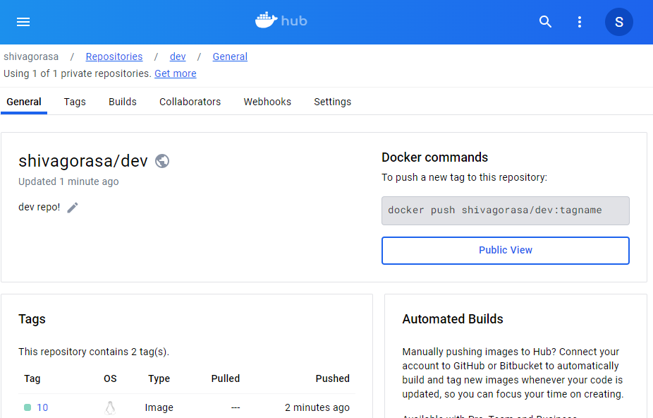
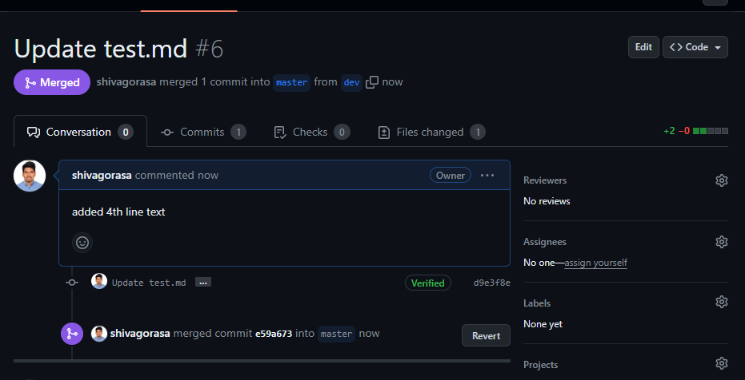

# Version Control

Now we have all the deployments done , let's push our code to our git repository where we can store and make necessary changes to source code in real-time.

- Initialize git repo locally using ``` git init```
- Add our files to the repo using ``` git add .```
- commit our changes to the repo with message using ``` git commit -m "Initial commit" ```
- Add a remote repo , here I have used as origin , ``` git remote add origin <my github-url>```
- push to dev branch using ``` git push origin dev```
- Also push entire source code to master branch to get a realtime deployment feel of project ``` git push origin master```
- Later in project if a developer makes changes in **dev** , i.e, adding features , it can be merged in **master** branch on proper approvals and tests

We can see both branches with source code in our github repo as shown below


# Jenkins Installation

To install Jenkins on an Ubuntu EC2 instance, we can follow these steps:

SSH into your EC2 instance: Connect to your Ubuntu EC2 instance via SSH.

Update package lists: Before installing any new software, it's a good practice to update the package lists:
```
sudo apt update
```

Jenkins requires Java to run. You can install OpenJDK using the following command:
```
sudo apt install openjdk-11-jdk
```
- add jenkins repo key to our system ``` wget -q -O - https://pkg.jenkins.io/debian/jenkins.io.key | sudo apt-key add - ```

- Add Jenkins repository to your package sources ``` sudo sh -c 'echo deb https://pkg.jenkins.io/debian-stable binary/ > /etc/apt/sources.list.d/jenkins.list' ```

update the package list again:
```
sudo apt update
```
### To install and start jenkins

Use following commands:

```
sudo apt install jenkins

sudo systemctl start jenkins

sudo systemctl enable jenkins

sudo systemctl status jenkins

```

Access Jenkins: Open our web browser and navigate to ``` http://your_ec2_instance_public_ip_or_domain:8080. ``` We will be prompted to unlock Jenkins by entering the initial admin password.

Retrieve initial admin password: You can find the initial admin password in the file ```/var/lib/jenkins/secrets/initialAdminPassword```. You can use cat command to view it:
```
sudo cat /var/lib/jenkins/secrets/initialAdminPassword
```

Follow the installation wizard: Paste the initial admin password obtained in the previous step into the Jenkins web interface to unlock it and proceed with the installation wizard.

Install recommended plugins: During the setup process, we'll be asked to choose between installing recommended plugins or selecting plugins to install manually. It's recommended to choose the option to install recommended plugins.

Create admin user: After the plugin installation is complete, we'll be prompted to create an admin user for Jenkins.

Once these steps are completed, Jenkins will be installed and ready to use on our Ubuntu EC2 instance.

After creating a user and logged in to Jenkins we can access jenkins dashboard as follows 


Next step is to install required pluggins for the project , 
here we are using following plugins apart from default that's loaded with jenkins intital setup :
- CloudBees Docker Build and Publish plugin
Version1.4.0
- Docker Pipeline
Version572.v950f58993843
- Docker plugin
Version1.6
- docker-build-step
Version2.11
- GitHub Integration Plugin
Version0.7.0

Next is to add credentials of dockerhub and github so that we can automate build triggers

Go to Dashboard -> Manage Jenkins -> Credentials

Here add github credentials and dockerhub credentials as below:


With everything in place now let's configure github webhook to our repo so that build triggers are automated and when changes are made in git repo , we can execute the pipeline and it builds desired job

To configure github webhook 
- Go to your repo -> settings -> under code and automation select webhooks

- create a new webhook , under payload url ***http://3.228.8.40:8080/github-webhook/*** \

- content type ***application/json***

- Under Which events would you like to trigger this webhook?

- choose Let me select individual events. and select ***pull requests*** and ***Pushes***

- select Active and create a webhook 


 ## Now for jenkins task to create auto build trigger from dev and master branch

 Here I'm creating two pipelines one to monitor dev branch and if code changes are committed in dev branch , a new docker image is pushed to out dockerhub rep of dev and second pipeline monitors for changes in master branch and triggers a docker image to prod repo in dockerhub


 ### For first pipeline

 Go to jenkins dashboard -> new project -> create a new freestyle project

 under configuration -> source code management -> choose Git and add our repo here and select the credentials we've made earlier for github -> under Branches to build choose */dev

 

Under build triggers choose ***GitHub hook trigger for GITScm polling***


Under Build steps select execute shell to login to dockerhub account


Then for next build step add Dcker Build and Publish and select to dokcer hub rep that we have created earlier -> I'm using Tag as ${BUILD_NUMBER} to distungish from images -> under registry credentials select Docker credentials -> and Save 


After pipeline is created click on Build now to check if everything is working properly or not


If pipeline is successful it should show as following in console with Finished: Success and

```
Started by user Shiva Kumar 
Running as SYSTEM
Building in workspace /var/lib/jenkins/workspace/pipeline_to-dev
The recommended git tool is: NONE
Warning: CredentialId "github login " could not be found.
Cloning the remote Git repository
Cloning repository https://github.com/shivagorasa/Demo-web-app.git
 > git init /var/lib/jenkins/workspace/pipeline_to-dev # timeout=10
Fetching upstream changes from https://github.com/shivagorasa/Demo-web-app.git
 > git --version # timeout=10
 > git --version # 'git version 2.34.1'
 > git fetch --tags --force --progress -- https://github.com/shivagorasa/Demo-web-app.git +refs/heads/*:refs/remotes/origin/* # timeout=10
 > git config remote.origin.url https://github.com/shivagorasa/Demo-web-app.git # timeout=10
 > git config --add remote.origin.fetch +refs/heads/*:refs/remotes/origin/* # timeout=10
Avoid second fetch
 > git rev-parse refs/remotes/origin/dev^{commit} # timeout=10
Checking out Revision ac9084e9bc90a01459dc3820d69362600b89acaf (refs/remotes/origin/dev)
 > git config core.sparsecheckout # timeout=10
 > git checkout -f ac9084e9bc90a01459dc3820d69362600b89acaf # timeout=10
Commit message: "Update test.md"
 > git rev-list --no-walk ac9084e9bc90a01459dc3820d69362600b89acaf # timeout=10
[pipeline_to-dev] $ /bin/sh -xe /tmp/jenkins12761260441755647397.sh
+ docker login --username shivagorasa --password Shivask1@23
WARNING! Using --password via the CLI is insecure. Use --password-stdin.
WARNING! Your password will be stored unencrypted in /var/lib/jenkins/.docker/config.json.
Configure a credential helper to remove this warning. See
https://docs.docker.com/engine/reference/commandline/login/#credentials-store

Login Succeeded
[pipeline_to-dev] $ docker build -t shivagorasa/dev:10 --no-cache=true --pull=true /var/lib/jenkins/workspace/pipeline_to-dev
#0 building with "default" instance using docker driver

#1 [internal] load build definition from Dockerfile
#1 transferring dockerfile: 395B done
#1 DONE 0.1s

#2 [auth] library/nginx:pull token for registry-1.docker.io
#2 DONE 0.0s

#3 [internal] load metadata for docker.io/library/nginx:1.19.10
#3 DONE 0.3s

#4 [internal] load .dockerignore
#4 transferring context: 2B done
#4 DONE 0.0s

#5 [1/4] FROM docker.io/library/nginx:1.19.10@sha256:df13abe416e37eb3db4722840dd479b00ba193ac6606e7902331dcea50f4f1f2
#5 CACHED

#6 [internal] load build context
#6 transferring context: 3.56MB 0.1s done
#6 DONE 0.1s

#7 [2/4] COPY nginx.conf /etc/nginx/nginx.conf
#7 DONE 0.1s

#8 [3/4] COPY . /var/www/html
#8 DONE 0.1s

#9 [4/4] WORKDIR /var/www/html
#9 DONE 0.0s

#10 exporting to image
#10 exporting layers 0.1s done
#10 writing image sha256:63bacae5d3cdb770c8cd02878a2b07b7cd802309c78a77738ce89b43f6a70c37 done
#10 naming to docker.io/shivagorasa/dev:10 done
#10 DONE 0.1s
[pipeline_to-dev] $ docker push shivagorasa/dev:10
The push refers to repository [docker.io/shivagorasa/dev]
5f70bf18a086: Preparing
99503ab091e4: Preparing
cc8c4deab502: Preparing
f0f30197ccf9: Preparing
eeb14ff930d4: Preparing
c9732df61184: Preparing
4b8db2d7f35a: Preparing
431f409d4c5a: Preparing
02c055ef67f5: Preparing
c9732df61184: Waiting
4b8db2d7f35a: Waiting
431f409d4c5a: Waiting
02c055ef67f5: Waiting
eeb14ff930d4: Layer already exists
5f70bf18a086: Layer already exists
f0f30197ccf9: Layer already exists
c9732df61184: Layer already exists
4b8db2d7f35a: Layer already exists
431f409d4c5a: Layer already exists
02c055ef67f5: Layer already exists
cc8c4deab502: Pushed
99503ab091e4: Pushed
10: digest: sha256:31c50debb75adec3e70299281b3e552dbda1c4e8c4b09b813d75bb049084a470 size: 2194
Finished: SUCCESS
```

a docker image is publised to our docker hub account in dev repo as below




Now lets make some changes in dev repo in github and commit changes to dev repo


Now jenkins with webhook active , it'll catch changes made in dev and new build process is automatically triggerred and necessary changes are pushed to dockerhub as well


### Next for the second pipeline to push changes to dockerhub:prod repo 

Create a pipeline with above steps mentioned in first pipeline , here only change is we change branch to */master


and UNDER docker build and publish we select our prod repo which is private with tag ${BUILD_NUMBER}


Let's test by Build now :


we also got our image updated in docker hub


Now we can see the branch master is 1 commit behind ***dev***


We can see the following changes changes let's create a pull request  




with build trigger in place when merged successfully , it automatically pushes our new image with tag 6 to docker hub prod repo 


# Monitoring  with Prometheus and Grafana


Setup a monitoring system to check health status of the application


docker-compose.yml 
```
version: "3"

services:
  cadvisor:
    image: gcr.io/cadvisor/cadvisor:v0.45.0
    container_name: cadvisor
    privileged: true
    ports:
      - "8080:8080"
    volumes:
      - /:/rootfs:ro
      - /var/run:/var/run:ro
      - /sys:/sys:ro
      - /var/lib/docker:/var/lib/docker:ro
    networks:
      - monitoring

  prometheus:
    image: prom/prometheus:v2.38.0
    container_name: prometheus
    ports:
      - "9090:9090"
    volumes:
      - ./prometheus:/etc/prometheus
    command:
      - '--config.file=/etc/prometheus/prometheus.yml'
      - '--storage.tsdb.path=/prometheus'
      - '--web.console.libraries=/etc/prometheus/console_libraries'
      - '--web.console.templates=/etc/prometheus/consoles'
      - '--storage.tsdb.retention.time=200h'
      - '--web.enable-lifecycle'
    networks:
      - monitoring

  grafana:
    image: grafana/grafana:9.1.1
    container_name: grafana
    ports:
      - "3000:3000"
    volumes:
      - grafana_data:/var/lib/grafana
      - ./grafana/provisioning/dashboards:/etc/grafana/provisioning/dashboards
      - ./grafana/provisioning/datasources:/etc/grafana/provisioning/datasources
    networks:
      - monitoring

volumes:
  grafana_data:

networks:
  monitoring:
```

Afer above file is created , create a prometheus.yml file in same directory in prometheus folder 

prometheus.yml

```
prometheus.yml 
global:
  scrape_interval: 15s # By default, scrape targets every 15 seconds.

  # Attach these labels to any time series or alerts when communicating with
  # external systems (federation, remote storage, Alertmanager).
  external_labels:
    monitor: 'Docker-monitor'

# A scrape configuration containing exactly one endpoint to scrape:
# Here it's Prometheus itself.
scrape_configs:
  # The job name is added as a label `job=<job_name>` to any timeseries scraped from this config.
  - job_name: 'prometheus'

    # Override global default and scrape targets from this job every 5 seconds.
    scrape_interval: 5s

    static_configs:
      - targets: ['44.193.80.101:9090']
  - job_name: 'cadvisor'  # job to monitor cadvisor
    static_configs:
      - targets: ['44.193.80.101:8080']
  - job_name: 'docker'  # job to monitor docker containers
    scrape_interval: 5s
    static_configs:
      - targets: ['44.193.80.101:9323']
```


Next we need to add those ports above 9090 , 8080, and 9323 to be accessed by our instance , add those under security groups as follows and save it


### Integrate Docker Container with Grafana

Locate the configuration file of the Docker daemon, daemon.json. The file is usually found in the /etc/docker/ directory.

If the daemon.json file is not present in the specified location, create a new file named daemon.json.

Open the daemon.json file using a text editor.

sudo nano /etc/docker/daemon.json
Add the following code snippet to the daemon.json file:
```
{
        "metrics-addr" : "0.0.0.0:9323",
        "experimental" : true
}
```
save and exit the file.

For apply this change you have to restart docker service 

sudo systemctl restart docker


after this use ``` docker-compose up -d``` to run docker containers 

we can see above containers are created and we can also check with ```docker-compose-ps```


Prometheus can be accessed on port 9090


cadvisor on port 8080


and Grafana on port 3000

use ```admin``` as username and ```admin``` as password for initial setup \

later in next step we can cahnge the password


cadvisor metrics can be accessed 8080/metrics


and docker metrics can be accessed on 9323/metrics


## Add Prometheus Data Source in Grafana

Access the Configuration menu: Click on the gear icon (cogwheel) in the Grafana sidebar to open the Configuration menu.

Open the Data Sources section: Navigate to the Data Sources section by clicking on it within the Configuration menu.

Add a new data source: Click on the Add data source button.

Select Prometheus data source type: From the list of available data source types, choose Prometheus.

Configure the data source settings:

URL: Enter the URL of your Prometheus server. The default URL is typically http://localhost:9090/.

Access: You can choose the access method for your Prometheus server. The options may include “Direct” or “Proxy” depending on your setup. Refer to the Grafana documentation for detailed information on access methods.

Save and test the data source: Click the Save & Test button to save the newly configured Prometheus data source and test the connection.

Once the test is successful, you can use the Prometheus data source to create dashboards and visualize metrics in Grafana.

add prometheus data sources in grafana
save and test.

save prometheus data sources in grafana


## Monitor Docker Containers with Grafana


Below are some example Prometheus Docker Metrics

```
engine_daemmon_engine_cpus_cpus – Shows number of Engine CPU metrics
engine_daemon_container_states_containers{state=”stopped”} – Shows stopped containers
engine_daemon_container_states_containers{state=”paused”} – Shows paused containers
engine_daemon_container_states_containers{state=”running”} – Shows running containers
Click on Dashboards and then click on Create Dashboard -> Add Visualization -> select Prometheus Data Source
```

In the Metrics browser selection select ```engine_daemmon_engine_cpus_cpus``` then select job and job name is ```docker```. Then click Run queries will fetch the number of Engine CPU.

Here I have created 4 panes of visualization using docker metrics and cadvisor metrics

- To check running docker containers

  

- Containers i/o time

  

- Cpu's utilization by container

  

- and docker engine CPU

  


And saved as New Dashboard which shows as follows 


### ___Thus we can setup monitoring of our containers with grafana and prometheus with cadvisor metrics and docker metrics___


# Finally to add alerting system if a container goes down

To manage alerts I created a dashboard in grafana which tracks for container last seen 


demo-web-app is where our app is running on port 80 


## To add alert navigate to left pane -> Alerting -> Alert rule to add alert rule

Select data-source as Prometheus

Add following rule under query A  ```container_last_seen{container_label_com_docker_compose_project="demo-web-app"}```


Alert evaluates for every 1min for 5min

Add details for your alert and save and exit


## Next to send email , we need to configure smtp as gmail here we use following method


- Modify grafana service in docker-compose.yml

```
grafana:
    image: grafana/grafana:9.1.1
    container_name: grafana
    ports:
      - "3000:3000"
    volumes:
      - grafana_data:/var/lib/grafana
      - ./grafana/provisioning/dashboards:/etc/grafana/provisioning/dashboards
      - ./grafana/provisioning/datasources:/etc/grafana/provisioning/datasources
      - ./grafana.ini:/etc/grafana/grafana.ini  # Mount grafana.ini here
    networks:
      - monitoring

volumes:
  grafana_data:

networks:
  monitoring:
  ```

- Make sure you have a grafana.ini file with the SMTP configuration in the same directory as your Docker Compose file. 

```
[smtp]
enabled = true
host = smtp.gmail.com:587   
user = youremail@gmail.com     # use your email id 
password = yourapppassword     # use app password of google account
skip_verify = true        
from_address = youremail@gmail.com
from_name = Grafana

```

- With this configuration, Grafana will use the SMTP settings provided in grafana.ini to send email notifications.

After this is done we can see following status of alerts as follows

- alert active


- alert pending after container goes down


- changed to firing after contianer went down


- Successful email is sent when our container is down


- When we again fire up ur container state goes from pending -> resolved and alert will again be active


Thus a successful email alert is setup to monitor docker containers health and we can also add various metrics to monior and create alerts accordingly


___Submitted By Shiva Kumar Gorasa___