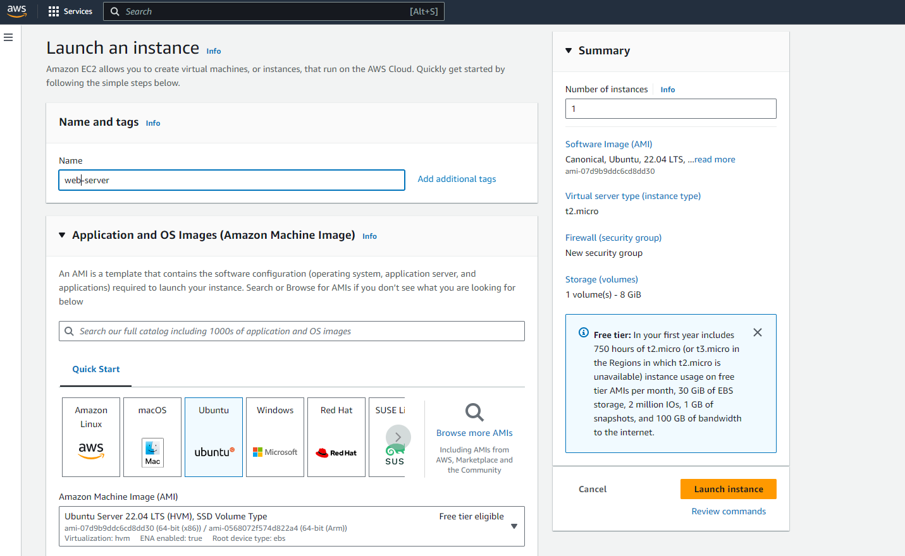
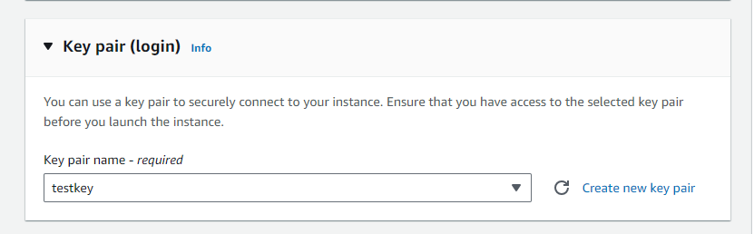
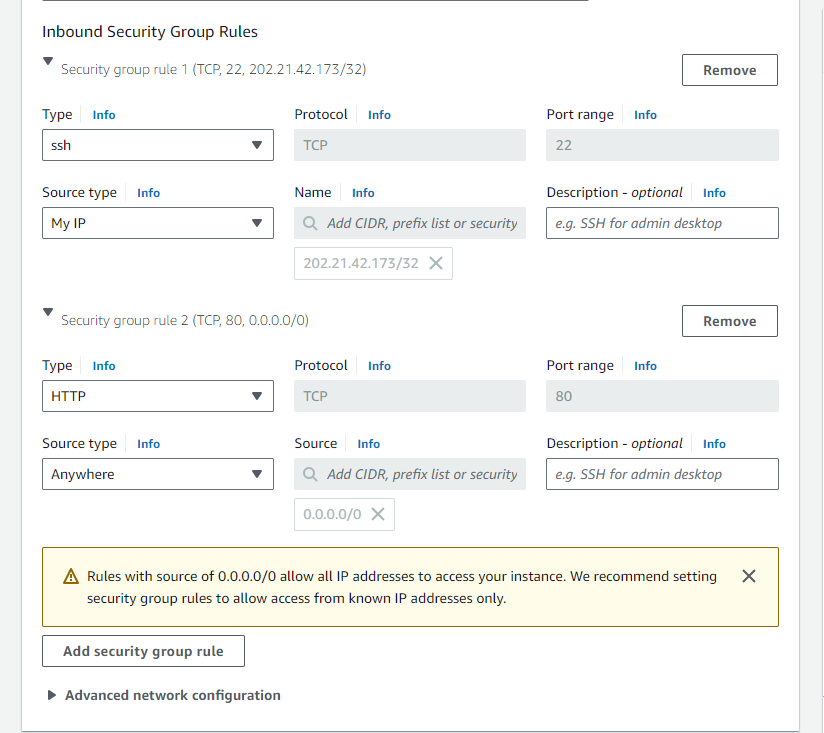
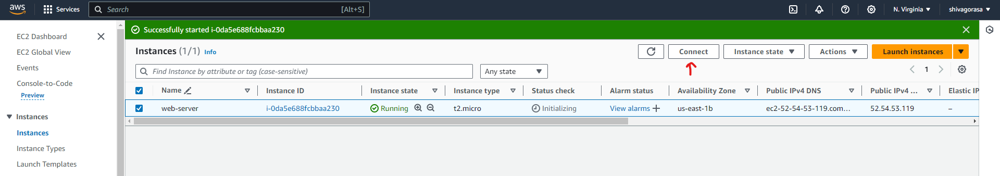
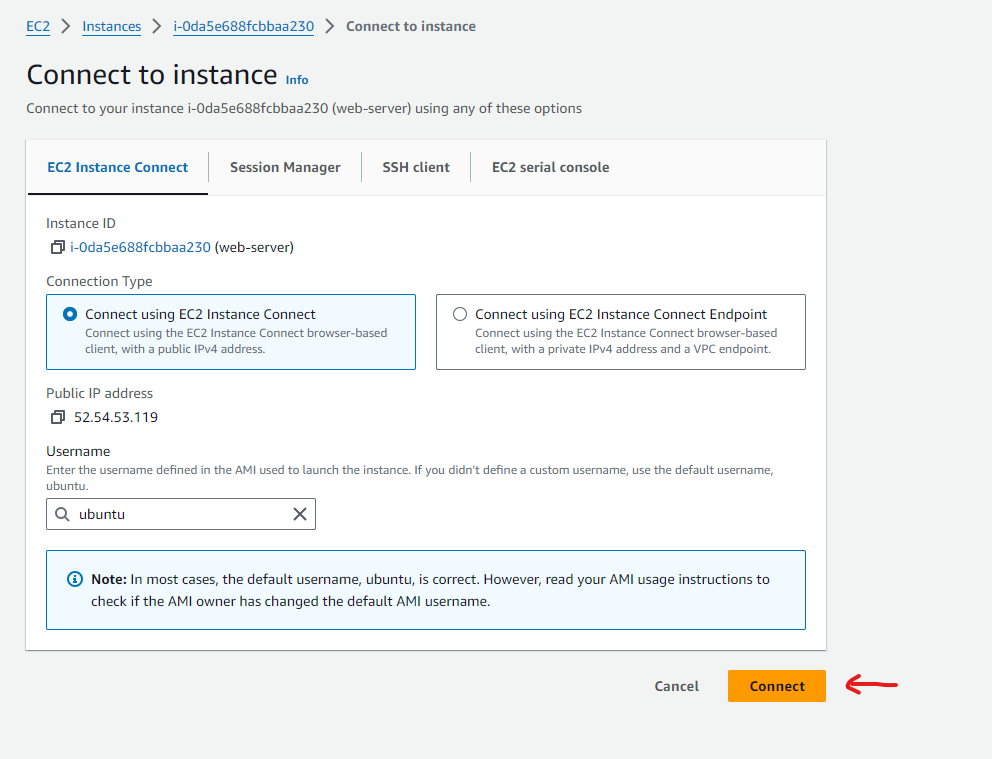
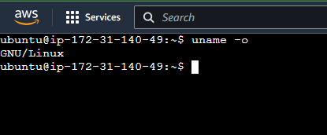
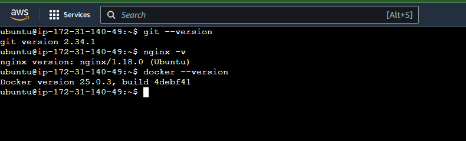
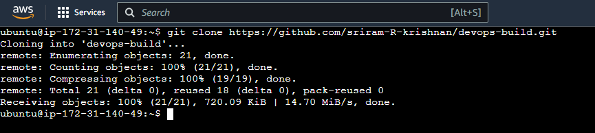
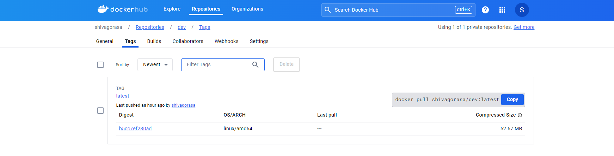

# **Application Deployment**

## (Deploy the given react appliation to a production ready state)


**Task**: We need to clone the following repository and deploy the application on port 80 [HTTP]

Repo URL :  https://github.com/sriram-R-krishnan/devops-build


**Approach**: Here a react web app is provided to us we need to deploy that application on our webserver, Here I'm using nginx as my webserver to deploy given application on port 80.\
(By default nginx controller listens on port 80 and 443)


### **Now let's start to create a ec2 instance as per given requirements and as per above mentioned approach**

**Requirements**
> Launch a t2.micro instance and deploy the created application \

> Configure SG as below: \
  - Whoever has ip address can access the application
  - login to server should be made from my ip address

**Step 1** :
- Launch an ec2 instance with ubuntu server 22.04 t2.micro

  

- create a keypair to ssh from local machine

  

- add following security inbound rules as mentioned in above requirements and launch an instance
  
  

- verify creation of our ec2 instance and connect to instance , here I'm using  ec2 instance connect , we can also use ssh client to login using gitbash or other clients

  

- Connect to ec2 Instance connect by clicking on Connect , a new tab opens with ssh connection terminal where we can run required commands

  

  


# Installing Git, Nginx, and Docker on Ubuntu EC2 Instance

## 1. Update Package Lists


**Install Git**
``` bash
sudo apt update
sudo apt install git
``` 

**Install Nginx**
``` bash
sudo apt install nginx
nginx -v
--start nginx service---
sudo systemctl start nginx
sudo systemctl enable nginx
sudo systemctl status nginx -- to check status of nginx
```

**Install Docker**
``` bash
sudo apt update
sudo apt install apt-transport-https ca-certificates curl software-properties-common
curl -fsSL https://download.docker.com/linux/ubuntu/gpg | sudo apt-key add -
sudo add-apt-repository "deb [arch=amd64] https://download.docker.com/linux/ubuntu $(lsb_release -cs) stable"
sudo apt update
sudo apt install docker-ce
docker --version
sudo systemctl enable docker
sudo systemctl status docker
```

### All above mentioned are installed and verified



As we installed git in our instance let's clone given repo link to our instance so that we can use that to make necessary changes and deploy with nginx

## Clone Repository to our ec2 instance

Use following command to clone git repo to out instance directory

```
git clone https://github.com/sriram-R-krishnan/devops-build.git
```



Now we have required files , let's make necessary changes for initial deployment on port 80 as required

### **Create a Docker file to use nginx official image , copy files and expose app on port 80**

```
# Using official Nginx image as the base image
FROM nginx:1.19.10

# Copy the Nginx configuration file for our web app
COPY nginx.conf /etc/nginx/nginx.conf

# Copy our web application files into the Nginx document root
COPY . /var/www/html 

WORKDIR /var/www/html -

# Expose port 80 to the outside world
EXPOSE 80  

CMD ["nginx", "-g", "daemon off;"]
```

### **Create a docker-compose.yml file and save in working directory to use above Dockerfile**

```
version: '3'
services:
  web:
    build: .
    ports:
      - "80:80"
    volumes:
      - ./nginx.conf:/etc/nginx/nginx.conf:ro
      - ./html:/usr/share/nginx/html
    restart: always
```

### **Let's create a nginx.conf file in working directory to listen on port 80**

```
events {

}

http {
    # Configure HTTP server
    server {
        listen 80;              # Listen on port 8080
        server_name localhost;  # Set your server name here

        # Define the location of the root directory
        root /var/www/html;

        # Specify the default file to serve
        index index.html;

        # Configure error and access logs
        error_log /var/log/nginx/error.log;
        access_log /var/log/nginx/access.log;

        # Configure location rules
        location / {
            try_files $uri $uri/ /index.html;
        }

        # Handle requests for favicon.ico
        location = /favicon.ico {
            access_log off;
            log_not_found off;
        }
    }
}

```


After above files are cerated and saved in working directory, 

### Let's test or application with follwoing command

```
docker-compose up -d (-d is used for detached mode)
```

### when we hit public Ipv4 address on port 80 we should see the application running


Hence we successfully deployed our app on port 80 with nginx and docker


Now next task is to automate the the build process so that we can push our created docker container to dockerhub account 

login to docker hub using 

``` 
docker login --username <username> and --password <password>
```

- After you login , make sure to create 2 repo's  **"dev"** and **"prod"** to push images, make sure **"prod"**  repo is private and **"dev"** is public.

## Next task is to create build.sh and deploy.sh to automate build and deploy process

### To create build.sh -- to build docker images

build.sh script
``` bash
#!/bin/bash

# Build the app without cache
docker-compose build --no-cache
```

### To create deploy.sh -- to deploy docker images to dockerhub account where we have 2 repositories one named dev and one named prod

deploy.sh script here I have added argument as dev or prod to deploy images directly to those repositories in dockerhub and also run to cross check

``` bash
#!/bin/bash

# Check if an argument is provided
if [ -z "$1" ]; then
    echo "Usage: $0 <target>"
    echo "Specify 'dev' or 'prod' as the target."
    exit 1
fi

# Check the target argument
if [ "$1" == "dev" ]; then
    # Tag the built image for the dev repository on Docker Hub
    docker tag "$(docker images -q | head -n 1)" shivagorasa/dev:latest
    
    docker push shivagorasa/dev:latest
    
    docker run -d -p 80:80 shivagorasa/dev:latest
elif [ "$1" == "prod" ]; then
    # Tag the built image for the prod repository on Docker Hub
    docker tag "$(docker images -q | head -n 1)" shivagorasa/prod:latest
    
    docker push shivagorasa/prod:latest
    
    docker run -d -p 80:80 shivagorasa/prod:latest
else
    echo "Invalid target. Specify 'dev' or 'prod'."
    exit 1
fi
```


Use following commands to execute bash scripts


```
./build.sh --- to build docker image

./deploy.sh <target> --- here targer refers to dev or prod of dockerhub so that image gets pushed to respective repository

./deploy.sh dev -- docker image is pushed with tag:latest to my dockerhub account
```




when we hit on public IPv4 address of ec2 instance we can get following output again running from docker container on port 80->80 and our docker images are pushed to docker hub as shown 

 


___Submitted By Shiva Kumar Gorasa___